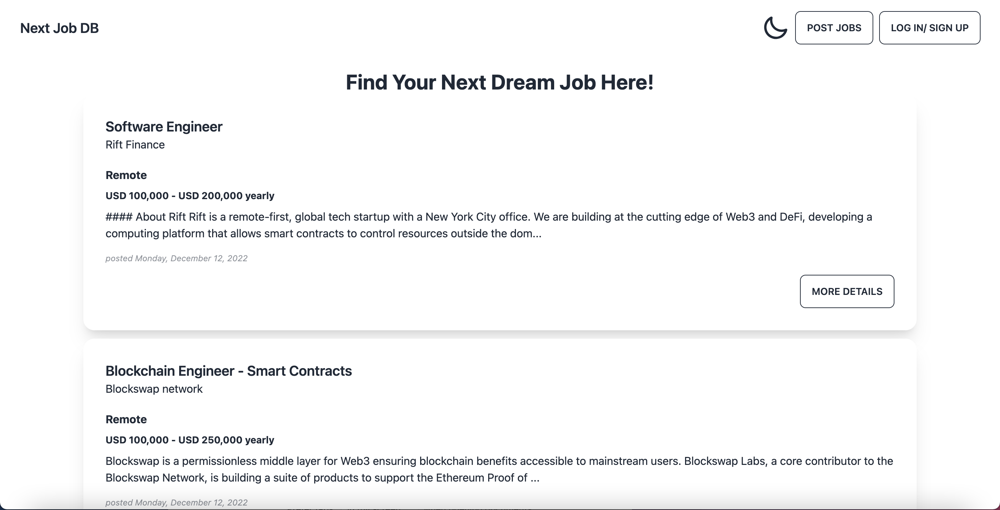

# NEXT-Job-DB

A online job board website created during the NEXT Academy bootcamp using SvelteJS and SvelteKit. 

I made this project to make a responsive online job board website (also mobile responsive), and to practice working with APIs. The project is created using Svelte and SvelteKit. API fetch data from Pocketbase hosted by Docker.

## Description

A website that connects recruiters and potential candidates and vice-versa.
- Users are required to have an account and logged in before posting a job
- Only job owners can update and delete jobs

## Languages/Tools Used
- HTML
- TailwindCSS
- JavaScript
- Svelte & SvelteKit

## Summary
- Fetching API to create, update, and delete job postings
- Responsive website achieved using TailwindCSS
- File based routing through SvelteKit
- Deployed on Cloudflare

## Preview

## Live Demo Here
https://next-db-jobsite.pages.dev/

